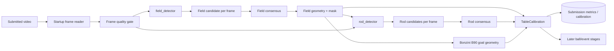
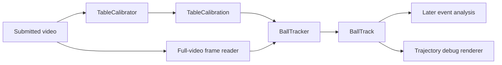

# Phase 1A: Table and Rod Detection

## Objective

* [ ]

The first implementation supports one fixed environment: a Bonzini table,
filmed from a diagonal top-down camera. Each side has one goalkeeper, two
defenders, five midfielders, and three forwards; the teams are red and blue.
There are exactly eight rods in total.

This stage does **not** track the ball, classify events, validate the exercise,
or process the whole video. Its output is the shared coordinate system that
those later stages consume.

## Why the beginning of the video is enough

The table's field boundary and rod layout do not change during a submitted
clip. Processing every frame would spend CPU rediscovering static geometry and
would make results less stable when hands, ball motion, glare, or compression
artifacts appear later.

Use a short **calibration window** instead of one initial frame:

- Inspect the first 3 seconds, capped at 90 frames.
- Select up to 15 evenly spaced frames from that window.
- Skip frames that are blurred or too dark.
- Detect the field and rods independently in each retained frame.
- Select a consensus result across frames, not the first successful result.

This remains quick while guarding against a bad first frame. It is sufficient
only while the camera remains fixed. A later camera-movement check belongs in
the worker pipeline and can mark the submission `pending_review`.

Submitted and regression-fixture videos must be at least 5 seconds and 720p.
Audio is ignored and can be removed from test extracts.

Field confidence is a calibrated heuristic, not a probability. It prioritizes
quadrilateral geometry and temporal stability, while using visible field
coverage as a secondary signal so a well-framed professional recording is not
penalized merely because the camera includes surrounding context. Candidates
below the confidence gate remain review cases; they are not converted into a
successful calibration by rescaling the score.

## Scope and non-goals

### In scope

- Detect the playable field polygon and ordered corners.
- Produce a field mask and a normalized field coordinate system.
- Derive both Bonzini B90 goal mouths from detected field geometry and expose
  canonical bounds for downstream ball tracking. Use the documented defaults:
  1200 × 700 mm playfield, 200 mm centered opening, and 150 mm mouth depth
  beyond each short end.
- Detect horizontal rods within/around the detected table.
- Assign rods stable vertical indices from top to bottom.
- Verify the Bonzini layout: eight distinct rods, with player-colour evidence
  from the red and blue teams.
- Reject strong dark shadow bands inside the field when they have no player-colour
  evidence; goal-area rods remain eligible because they can be partially visible.
- Report goal geometry as an estimate derived from field calibration and the
  supported B90 dimensions; do not imply it was visually observed.
- Assign confidence and explainable diagnostics to every result.
- Persist the calibration result so later worker stages do not repeat it.
- Regression tests based on short video extracts and manually verified
  expected geometry.

### Not in scope

- Ball detection/tracking.
- Detecting individual player figures or the forward-middle player.
- Rod movement, rotation, possession, goals, or exercise validation.
- Automatic support for arbitrary table styles without a regression fixture.
- Automatic detection of the individual forward-middle player; this comes
  after static table and rod geometry is trusted.

## Source to reuse

Reuse and split the techniques from the root `AI-bbf/analyzer.py` only:

- Field: HSV green/cyan masking, morphological cleanup, largest-contour
  selection, Hough/contour corner fallbacks, and stable corner ordering.
- Rods: grayscale edges, Hough horizontal lines, field-relative filtering,
  player-colour evidence, merging, and vertical clustering.

Do not import or copy code from the nested `AI-bbf/foosball-ai` project.

The POC's `detect_rods` is a useful starting point but has known false-positive
behaviour. The MVP implementation must expose its threshold values through a
configuration object and report why candidates were rejected, rather than
hiding that logic inside one large method.

## Module architecture



### `app/detection/contracts.py`

Shared immutable dataclasses and no OpenCV algorithms:

- `FrameQuality`: frame index, timestamp, blur score, brightness score,
  accepted flag, rejection reason.
- `FieldGeometry`: four ordered pixel corners (`top_left`, `top_right`,
  `bottom_right`, `bottom_left`), bounding box, confidence, detection method.
- `Rod`: stable `index`, field-relative vertical position, pixel line segment,
  confidence.
- `GoalMouth`: canonical end (`start`/`end`), estimated aperture span and
  crossing line, confidence, and diagnostics. Coordinates are defined relative
  to the canonical field plane and computed from the supported B90 dimensions.
- `TableCalibration`: video metadata, sampled-frame diagnostics,
  `FieldGeometry`, rods, goal mouths and separate goal diagnostics, global
  field/rod confidence, warnings.

Use field-relative coordinates for rod identity:

$$
r_y = \frac{y_{rod} - y_{top}}{y_{bottom} - y_{top}}
$$

This makes results resilient to resolution changes. Pixel coordinates remain in
the contract for drawing/debugging.

### `app/detection/startup_frames.py`

Responsible only for opening a video and extracting the calibration sample:

- Read FPS/dimensions and reject unreadable videos.
- Sample evenly across `calibration_window_seconds`.
- Return BGR frames with frame index and timestamp.
- Apply basic quality gates: Laplacian variance for blur and mean luminance for
  darkness.

### `app/detection/field_detector.py`

`detect(frame) -> FieldGeometry | None`

- Converts a frame to HSV; applies configurable green/cyan ranges.
- Cleans the mask with morphological close/open operations.
- Selects the largest valid contour by field-area ratio.
- Attempts corners in order: Hough line intersections, contour approximation,
  `minAreaRect`, bounding rectangle.
- Orders four corners consistently and calculates a per-frame confidence from
  field-area ratio, polygon plausibility, and corner quality.

### `app/detection/field_consensus.py`

`combine(candidates) -> FieldGeometry | None`

- Discard candidates below the configured field confidence.
- Require a minimum number of successful sampled frames.
- Take the component-wise median of the ordered corners.
- Reject a result when corner spread across frames exceeds tolerance; that
  indicates camera movement or unstable detection.
- Rebuild the final polygon mask from the consensus corners.

### `app/detection/rod_detector.py`

`detect(frame, field_geometry) -> list[RodCandidate]`

- Restricts line detection to the field plus a modest horizontal margin.
- Uses Canny + probabilistic Hough lines from the POC.
- Keeps near-horizontal lines with a configurable minimum length relative to
  field width.
- Merges same-row Hough fragments before applying the length and confidence
  gates. This is required for goal rods, whose metal line is often interrupted
  by players or goal-area hardware.
- Scores candidates using line length, field overlap, brightness, and nearby
  player-colour evidence.
- Merges line fragments belonging to the same physical rod.
- Returns candidates only; it does not decide the final rod set.

The red/blue Bonzini team colours are evidence that a horizontal line is a
physical rod. They must not be used as the sole detection method: a player may
be turned away, covered by a hand, or poorly lit in an individual sample.

### `app/detection/rod_consensus.py`

`combine(candidates_by_frame, field_geometry) -> list[Rod]`

- Convert each candidate's y coordinate to `r_y`.
- Cluster candidates vertically across all calibration frames.
- Derive one rod per cluster using median position and a confidence based on
  sample coverage/position spread.
- Sort top-to-bottom and assign indices `0..n-1`.
- Extend each selected Hough line to its intersections with the left and right
  field-side lines. Preserve the detected perspective slope rather than
  synthesizing a horizontal line from the field geometry.
- Keep a rod whose canonical centre lies outside the field as its detected
  segment. Goal-area hardware does not share the playable field's side bounds.
- Require rod 0 to remain within the supported canonical goal-area envelope.
  A missing goalkeeper row or a line far above the field is a calibration
  warning requiring review, never a relabeled in-field rod.
- When strict rod consensus fails, debug rendering must still show the stable
  observed rows. These diagnostics never become a successful calibration.
- Require the Bonzini layout: eight rods with all rods separated by a minimum
  normalized distance. Anything else is a calibration warning, not a guessed
  result.
- Store the red/blue player-colour evidence in diagnostics for each rod.

The camera is diagonal top-down, so raw pixel `y` is not sufficient for a
durable rod identity. Transform rod centre points through the field homography
into a canonical top-down table plane first, then sort by their normalized
canonical vertical position. This means small perspective changes do not swap
rod order.

Do **not** label the 3-bar in the initial implementation. Add that mapping
once one canonical camera orientation is confirmed in the annotated fixtures.

### `app/detection/calibrator.py`

Orchestrates the above components:

`calibrate_table(video_path) -> TableCalibration`

It should be callable by tests and later by the Celery task without FastAPI,
database, or storage dependencies.

## Worker integration

When the CV pipeline is connected, `process_submission` follows this part of
the lifecycle:

1. Worker marks the submission `processing`.
2. Worker calls `calibrate_table(submission.video_url)` once.
3. It writes calibration JSON and confidence into `Submission.metrics`.
4. If calibration fails or confidence is below threshold, it records the
   diagnostic and sets `pending_review`; it must not claim that the player
   failed the exercise.
5. A successful calibration becomes the input to later ball tracking, event
   analysis, and the exercise validator.

## Configuration

Keep these in `app/detection/config.py`, with defaults based on the POC and
loaded from settings later:

- field HSV green/cyan thresholds.
- morphology kernel size.
- calibration window duration, sampled frame count, and minimum accepted
  frames.
- minimum field area ratio and field confidence.
- blur/darkness thresholds.
- Hough/Canny thresholds.
- maximum horizontal-line angle.
- rod minimum length as a ratio of field width.
- minimum candidate coverage and cluster separation.
- allowed number of rods for the initial supported layout.
- expected Bonzini rod count (`8`) and red/blue HSV colour ranges.

Version the configuration (`detector_config_version`) in every
`TableCalibration` result. A changed threshold can then be traced to a test
or production outcome.

## Test architecture

### Fixture layout

```text
tests/
├── fixtures/
│   ├── table_detection/
│   │   ├── clean_top_down.mp4
│   │   ├── phone_angle.mp4
│   │   ├── dim_lighting.mp4
│   │   └── ... supplied short extracts only
│   └── expected/
│       ├── clean_top_down.json
│       ├── phone_angle.json
│       └── dim_lighting.json
├── unit/
│   ├── test_frame_quality.py
│   ├── test_field_detector.py
│   ├── test_field_consensus.py
│   ├── test_rod_detector.py
│   └── test_rod_consensus.py
└── integration/
    └── test_table_calibration_regression.py
```

Each expected JSON file is a small manual annotation for one extract:

```json
{
  "fixture": "clean_top_down.mp4",
  "expected_rod_count": 8,
  "field_corners": [[112, 84], [1171, 91], [1194, 681], [96, 675]],
  "corner_tolerance_px": 25,
  "rod_y_positions": [130, 204, 281, 358, 436, 512, 589, 648],
  "rod_tolerance_px": 18
}
```

The expected values must be measured/verified by a person using an image
annotation tool. They are test data, not values generated by the detector.

### Unit tests

No video fixture is needed for these:

- Corner ordering always returns top-left, top-right, bottom-right,
  bottom-left.
- Consensus rejects too few candidates and unstable corner spread.
- Rod clustering merges duplicate line fragments but keeps physically distinct
  rod positions separate.
- Field-relative coordinates stay correct when input geometry is scaled.
- Frame quality correctly rejects synthetic dark/blurred inputs.

### Regression/integration tests

* [ ] For every supplied extract:

- Run `calibrate_table` with the committed detector configuration.
- Assert calibration succeeds.
- Assert each corner lies within its annotated pixel tolerance.
- Assert expected rod count and each rod's y coordinate lies within tolerance.
- Assert global and component confidences exceed fixture-specific minimums.
- Write an annotated image/video only when a test fails, stored in a temporary
  directory so it is available as CI output but never committed.

Add negative fixtures too: no table, extreme blur, and unsupported camera angle
should produce a clear failure/warning instead of an incorrect confident result.

### Fixture policy

- Keep extracts at 5 seconds or more and only the start of the original video.
- Use 720p or higher resolution. Reject lower-resolution clips before testing.
- Never commit full user submissions.
- Remove audio from fixtures; detector tests do not need it.
- Use Git LFS only if the combined fixture size becomes inconvenient for normal
  Git clones. Start with normal Git for a small curated set.
- New table/camera/lighting support requires one new fixture plus annotation
  before threshold changes are merged.

## Acceptance criteria

1. `calibrate_table` processes only the configured startup window.
2. It returns ordered field corners, a field mask, rods sorted top-to-bottom,
   confidence, and diagnostics, or a structured calibration failure.
3. The implementation has no dependency on FastAPI, Celery, PostgreSQL, or the
   nested `foosball-ai` repository.
4. All committed fixture regressions pass with annotated tolerances.
5. Unsupported/low-quality fixtures fail safely with a useful warning rather
   than yielding a high-confidence geometry result.
6. Debug output can render the final field polygon and numbered rods over a
   sampled input frame for visual inspection.
7. Goal-mouth geometry is scaled from the accepted field consensus using the
   versioned Bonzini B90 defaults and serialized with estimate diagnostics.

## Delivery order

1. Create contracts/configuration and startup-frame reader with unit tests.
2. Extract/refactor POC field detection into `field_detector.py`; add field
   unit tests and the first annotated regression fixture.
3. Implement field consensus and debug overlay; make its regression pass.
4. Extract/refactor rod detection into `rod_detector.py`; start with one known
   table/camera setup and add rod annotations.
5. Implement rod consensus, confidence/diagnostics, and negative fixtures.
6. Add `calibrator.py`, integration tests, and worker persistence hook.
7. Only then begin ball tracking/event analysis, using `TableCalibration` as
   their input.

## Class-by-class implementation plan

Build in this exact order. Each step has a useful output and a test boundary;
do not start the next detector class until the current step has fixture-backed
tests.

### Step 1: `DetectionConfig`

**File:** `app/detection/config.py`

Create a frozen configuration dataclass containing the calibration-window,
quality-gate, HSV, Canny/Hough, contour, rod clustering, and Bonzini-layout
thresholds. Include `expected_rod_count = 8`, red/blue HSV ranges, and a
configuration version string.

**Done when:** configuration has defaults based on `AI-bbf/analyzer.py` and a
unit test can override every threshold without mutating global state.

### Step 2: contracts

**File:** `app/detection/contracts.py`

Create immutable dataclasses: `VideoMetadata`, `SampledFrame`,
`FrameQuality`, `FieldGeometry`, `RodCandidate`, `Rod`, and
`TableCalibration`. Include serializable `to_dict()` methods for persistence
and debug reports.

**Done when:** a unit test confirms a calibration result can be serialized to
JSON without OpenCV/NumPy-only values leaking into the API/database layer.

### Step 3: startup frame reader

**File:** `app/detection/startup_frames.py`

Implement `StartupFrameReader.read(video_path)`. Validate an input is at least
720p and five seconds long; select up to 15 evenly spaced frames within the
first three seconds. Implement `FrameQualityEvaluator` using brightness and
Laplacian-variance blur scores.

Implementation plan:

1. Read and validate the video metadata before decoding sampled frames.
2. Generate unique, evenly spaced frame indices from the configured startup
   window and decode only those BGR frames.
3. Retain quality diagnostics for every sampled frame and return only accepted
   image buffers for later detector stages.
4. Cover unreadable, too-short, low-resolution, dark, blurred, and valid
   synthetic videos in focused unit tests.

**Done when:** unit tests cover unreadable, too-short, low-resolution, dark,
and blurred inputs; one provided video fixture produces accepted frames.

### Step 4: annotation and debug renderer

**Files:** `tools/annotate_table.py`, `app/detection/debug_renderer.py`

Build the manual annotation tool before tuning the detector. It opens a chosen
startup frame, lets you click four field corners then each rod centre line, and
writes the expected JSON fixture. The renderer consumes either expected JSON
or `TableCalibration` and writes an image with field corners/polygon, numbered
rods, confidence, and warnings.

Implementation plan:

1. Render field polygons, corner labels, rod lines, indices, confidence, and
   warnings from an expected-fixture mapping or `TableCalibration`. For
   estimated goal mouths, distinguish the aperture outline from the crossing
   line and label the canonical goal end and B90-derived geometry.
2. Provide a command-line annotation tool that displays a selected frame,
   captures ordered corner clicks followed by rod-line clicks, and writes the
   expected-fixture JSON format.
3. Add deterministic renderer tests using in-memory images and synthetic
   calibration data; manually verify generated artifacts for supplied videos
   before committing their annotations.

**Done when:** every provided extract has one committed expected JSON file and
one generated annotated PNG that a human has checked. The generated PNG is a
debug artifact; the JSON is the regression-test ground truth.

### Step 5: field detector

**File:** `app/detection/field_detector.py`

Implement `FieldDetector.detect(frame)`. Reuse only the POC's HSV masking,
morphology, largest-contour selection, corner fallback sequence, and corner
ordering. Return a `FieldGeometry` candidate with method and confidence, not
a raw contour.

**Done when:** the first annotated fixture passes corner tolerance and all
synthetic unit tests preserve corner order.

Implementation plan:

1. Build the configured green/cyan HSV mask and clean it with close/open
   morphology.
2. Select the largest contour meeting the configured frame-area threshold.
3. Try Hough-derived intersections, contour approximation, `minAreaRect`, and
   bounding-rectangle corners in that order, then normalize corner ordering.
4. Score the candidate from area coverage and polygon plausibility, returning
   `None` when no valid field contour exists.

### Step 6: field consensus and canonical transform

**Files:** `app/detection/field_consensus.py`,
`app/detection/geometry.py`

* [ ] Implement `FieldConsensus.combine(candidates)` using median corners and a
  spread rejection threshold. Build the perspective transform from the diagonal
  image to canonical table coordinates. Provide helpers for pixel-to-canonical
  and canonical-to-pixel points.

**Done when:** all fixture field corners pass, and a scaled/perspective
synthetic geometry test returns stable normalized coordinates.

Implementation plan:

1. Filter low-confidence candidates and require the configured minimum count.
2. Compute component-wise median corners and reject candidates whose corner
   spread exceeds the configured tolerance.
3. Expose a perspective-transform helper using a fixed `1000 x 600` canonical
   table plane for scale-stable coordinates.
4. Test insufficient/unstable consensus, corner ordering, and round-trip
   pixel/canonical transformations on synthetic geometry.

Manual validation command:

```bash
pytest -s tests/manual/test_field_detection_manual.py
```

This diagnostic test runs the detector over all supplied videos and prints
sampled frame indices, detection methods, confidences, detected corners, and
errors against the human annotations. It verifies that geometry is detected
and ordered; the printed values remain a human review step for clips outside
the initial supported landscape configuration.

### Step 7: rod detector

**File:** `app/detection/rod_detector.py`

Implement `RodDetector.detect(frame, field_geometry)`. Extract the POC's
Canny/Hough candidate generation and field-relative filtering, then simplify
the scoring into named components: horizontal angle, relative length,
field overlap, red/blue player-colour evidence, and line quality. Return
`RodCandidate` values with their scores/diagnostics.

**Done when:** the debug overlay visibly shows accepted and rejected candidates
for the first fixture, and no raw Hough-line API escapes the module.

**Status:** Implemented in `app/detection/rod_detector.py`. Candidates are
canonicalized before scoring, include named angle/length/overlap/colour/line
quality diagnostics, and rejected candidates remain available for the debug
overlay. Hough fragments are merged by normalized field-relative height.

### Step 8: rod consensus and Bonzini validation

**File:** `app/detection/rod_consensus.py`

Implement `RodConsensus.combine(candidates_by_frame, field_geometry)`. Map
candidate centres to canonical coordinates, cluster them across frames, sort
them, require exactly eight rods, and return one stable `Rod` per cluster.
Fail with diagnostics when the layout is incomplete or ambiguous.

**Done when:** all annotated fixtures assert eight rods and each canonical or
pixel y-position is within its recorded tolerance; negative fixtures fail
safely.

**Status:** Implemented in `app/detection/rod_consensus.py`. Supported clean
fixtures validate eight rods against annotated pixel y tolerances; incomplete
or unsupported goalkeeper layouts raise `RodConsensusError` and remain review
cases rather than being relabeled as a valid eight-rod layout.

### Step 9: calibration facade

**File:** `app/detection/calibrator.py`

Implement `TableCalibrator.calibrate(video_path)`. It coordinates Steps 3,
5–8 and returns `TableCalibration`; it must not know about FastAPI, Celery, or
SQLAlchemy.

**Done when:** `tests/integration/test_table_calibration_regression.py` runs
this one public entry point against every fixture.

Implementation plan:

1. Read startup frames once, then combine field candidates into a consensus
   field geometry.
2. When field geometry is available, run rod detection over the accepted
   startup frames and combine the candidates with strict Bonzini validation.
3. Return field or rod consensus failures as structured warnings and an empty
   rod collection so the worker can route the submission to review.
4. Cover every supplied fixture through `TableCalibrator.calibrate()` only:
   supported layouts return eight rods without warnings, while ambiguous
   layouts return review warnings without guessed rods.

Acceptance criteria:

- `calibrate()` returns JSON-serializable `TableCalibration` data without web,
  queue, ORM, or storage dependencies.
- Video validation errors continue to propagate from the startup reader.
- Field and rod consensus failures remain review diagnostics, never exercise
  failures or inferred rod layouts.
- Regression coverage calls no private calibrator components.

**Status:** Implemented and covered by
`tests/integration/test_table_calibration_regression.py`. The facade reads the
startup sample once, returns clean eight-rod calibrations for supported
fixtures, preserves ambiguous rod layouts as review warnings, and propagates
invalid video constraints from the startup reader.

### Step 10: worker hook

**File:** `app/worker/tasks.py`

Replace the current placeholder with one call to `TableCalibrator`. Persist its
JSON metrics and route a failed/low-confidence calibration to
`pending_review`. Do not add ball tracking or validation in this change.

**Done when:** an integration test verifies worker status handling for both a
successful calibration and a structured calibration failure.

Implementation plan:

1. Mark the submission `processing` before invoking the calibration facade.
2. Persist `TableCalibration.to_dict()` under `Submission.metrics` and copy
   its confidence to `Submission.confidence`.
3. Route calibration warnings, missing field/rod geometry, and low confidence
   to `pending_review`; a clean calibration also remains `pending_review`
   until later ball and exercise-validation stages are implemented.
4. Convert input-video validation errors into JSON-safe failure metrics with
   zero confidence and route them to `pending_review` without claiming an
   exercise failure.
5. Add focused worker tests for a clean calibration, a review calibration,
   and an invalid video, using a mocked database session and calibration
   facade.

Acceptance criteria:

- The worker calls only `TableCalibrator.calibrate()` for this CV stage.
- Calibration reports and validation failures are persisted as JSON-safe
  metrics with their associated confidence.
- No path introduced by this step approves or rejects an exercise.
- The database session is closed for missing submissions and every outcome.

**Status:** Implemented in `app/worker/tasks.py`. The worker persists the
calibration contract, records invalid video input as structured zero-confidence
metrics, and keeps every submission pending review until later exercise
validation stages exist.

## Inputs needed before implementation

- 3–5 provided extracts from the first five seconds of real submissions,
  including one clean view and one difficult-lighting view. They must be 720p
  or higher and at least five seconds long.
- Confirmation of the exact canonical camera orientation so that a later stage
  can map the correct stable rod index to the forward 3-bar.
- Manual annotations for field corners and rod centre lines. Step 4 provides
  the tool to create them.

# Historical Draft: Ball Tracking

The active ball-tracking design, implementation order, and acceptance criteria
live in [BALL_TRACKING_PLAN.md](BALL_TRACKING_PLAN.md). This retained draft is
historical context only; table calibration remains an independently deliverable
stage and must not gain ball-tracking code.

## Objective

Detect the yellow Bonzini ball throughout the submitted video after static
table calibration. Produce a JSON-serializable, time-ordered trajectory in
both pixel and canonical table coordinates, with explicit detected, missed,
and uncertain observations. This phase provides evidence for later event
analysis; it does not infer possession, player contact, goals, exercise
outcomes, or rod movement.

The only supported environment remains the calibrated Bonzini table filmed
from the documented diagonal top-down camera. A failed, warning-bearing, or
low-confidence table calibration is a review case: ball tracking must not
invent a field boundary or return an exercise result.

## Architecture and boundary



`TableCalibration` is immutable input to this stage. `BallTracker` owns video
decoding, the field-constrained candidate detector, and temporal association;
it has no FastAPI, Celery, SQLAlchemy, or storage dependency. The worker will
orchestrate calibration and tracking only after this phase has fixture-backed
regression coverage.

The initial detector may reuse only the root `AI-bbf/analyzer.py` techniques:
yellow HSV segmentation, morphology, contour area/aspect/circularity checks,
and prior-position distance scoring. Unlike the POC, all thresholds belong in
the immutable versioned configuration and every rejected or missed observation
must be diagnosable. Do not import from or copy the nested `foosball-ai`
project.

## Contracts

Add responsibility-specific ball contracts under `app/detection/contracts/`:

- `BallCandidate`: one per-frame contour candidate, including pixel centre,
  radius or bounding box, canonical centre, score components, and rejection
  reason when not selected.
- `BallObservation`: one result for every decoded frame: frame index,
  timestamp, optional selected candidate, state (`detected`, `missed`, or
  `uncertain`), confidence, and diagnostics.
- `BallTrack`: video metadata, calibration config version/reference,
  observations, aggregate confidence, detection coverage, longest missing
  interval, warnings, and `to_dict()`.
- `BallTrackingResult`: `BallTrack` plus optional debug-only candidate data;
  image buffers and OpenCV/NumPy values must never reach persistence.

Pixel coordinates remain available for overlays. Canonical coordinates are
derived through the existing field homography, making later geometric event
rules independent of clip resolution and perspective.

## Configuration

Extend `DetectionConfig` with a new detector-config version and explicit
ball-tracking settings:

- yellow HSV ranges for initial detection and continuity-assisted recovery;
- morphology kernel size and contour area bounds expressed relative to the
  canonical field area where practical;
- minimum/maximum circularity and bounding-box aspect ratio;
- field-mask erosion/inset and a canonical edge exclusion margin;
- maximum plausible canonical displacement per second, gap duration allowed
  for recovery, and association-score weights;
- minimum track coverage, maximum unresolved-gap duration, and confidence
  weights.

The initial values are hypotheses derived from the POC, not production truth.
Each threshold change requires a manually checked fixture, a tuning-log entry,
and focused regression results. Never loosen a threshold merely to make an
annotation pass.

## Processing model

1. Validate that calibration contains a field, no review warnings, and meets
   `minimum_calibration_confidence`; otherwise return a review-safe track with
   no inferred observations.
2. Open the video once, preserve authoritative frame index/FPS/timestamps, and
   process every frame in order. Decode failure becomes an explicit warning;
   do not silently renumber time.
3. Build an eroded field mask from the consensus polygon and transform valid
   candidate centres into canonical coordinates.
4. Generate yellow contour candidates in the constrained region. Record why
   contours were rejected: HSV, field bounds, size, aspect ratio,
   circularity, or edge margin.
5. Associate candidates to the prior accepted observation using canonical
   displacement per elapsed second and intrinsic contour quality. A high
   quality but implausibly distant candidate remains `uncertain` rather than
   causing a trajectory teleport.
6. Represent occlusion and ambiguity as `missed` or `uncertain` observations.
   Recovery after a short gap is permitted only within a configurable
   velocity/distance envelope; longer gaps split the track and lower global
   confidence.
7. Calculate coverage, missing intervals, candidate ambiguity, continuity,
   and calibration confidence into an explainable aggregate confidence.
   Below-threshold results remain review cases and never become an exercise
   failure.

No interpolation, smoothing, or predictive motion model may replace a missing
measurement in the persisted evidence. Later consumers may derive a smoothed
view while preserving the raw observation series.

## Delivery order

### Step 1: fixtures and annotations

Create curated five-second-or-longer 720p-or-higher ball-tracking extracts
from the supported setup. For each extract, manually annotate sampled ground
truth in `tests/fixtures/expected/`: frame index/timestamp, pixel ball centre,
visibility, and a tolerance. Include a clean sequence, moderate motion,
short occlusion, glare/yellow distractor, no-ball, and an unsupported or
calibration-failure case. Expected values are human-reviewed test data, never
detector output.

**Done when:** every threshold-tuning fixture has a checked JSON annotation
and an annotated PNG/video artifact produced by the debug renderer.

### Step 2: contracts and configuration

Implement the contracts above and configuration defaults with JSON
serialization tests. Keep raw image arrays out of all `to_dict()` results.

**Acceptance criteria:** a synthetic detected/missed/uncertain track serializes
without NumPy types; configuration overrides are immutable; all new settings
are covered by default/override tests.

### Step 3: full-video frame reader and geometry helpers

Add a reader dedicated to sequential full-video decoding; do not overload the
startup calibration reader. It yields frames with indices and timestamps and
can be tested with small synthetic videos. Reuse the existing geometry helpers
to build the eroded field mask and convert centres to/from canonical space.

**Acceptance criteria:** frame indices and timestamps remain monotonic at
non-integer FPS, decoder failures are reported, and a point transformed from
pixel to canonical and back remains within tolerance.

### Step 4: per-frame ball candidate detector

Implement `ball_detector.py` with a pure
`detect(frame, field_geometry) -> BallDetectionFrame` API. It creates the
yellow HSV mask, constrains it to the inset field, applies morphology, scores
contours, and returns selected and rejected candidates without temporal state.

**Acceptance criteria:** synthetic tests reject wrong hue, non-circular noise,
out-of-field blobs, and edge artifacts while retaining a valid ball. Fixture
tests validate centres against annotations without temporal association.

### Step 5: temporal association and track confidence

Implement `ball_tracker.py` over sequential frame-reader output. Use elapsed
time and canonical displacement, not a raw fixed pixel jump, to select the
track candidate. Preserve every frame's observation and calculate aggregate
diagnostics without filling gaps.

**Acceptance criteria:** unit tests cover a continuous path, short recoverable
occlusion, long unresolved gap, competing yellow blob, and a physically
implausible jump. Regression fixtures meet their declared detection coverage,
centre-error, and maximum-gap bounds.

### Step 6: debug renderer and regression facade

Extend `debug_renderer.py` to draw the field, selected ball centres, state
colours, frame/timestamp, confidence, and trajectory segments that do not
cross missing intervals. Add `BallTrackingFacade.track(video_path, calibration)` or an equivalently named dependency-free public entry point for
integration tests. Generated debug artifacts go to temporary test output only.

**Acceptance criteria:** deterministic in-memory renderer tests pass; every
fixture is exercised through the public facade; low-confidence, no-ball, and
unsupported inputs produce clear warnings rather than false trajectories.

### Step 7: worker integration

After Steps 1-6 pass, update `process_submission` to invoke calibration once
and then tracking only for a clean calibration. Persist both serializable
reports under `Submission.metrics`, combine their confidence conservatively,
and keep status `pending_review`. Do not add event analysis or approval/
rejection logic in this step.

**Acceptance criteria:** mocked worker tests cover a clean track, a
calibration-review result that skips tracking, a low-confidence track, and a
decoder/input failure. Every branch closes the database session and records
JSON-safe metrics.

## Test layout

```text
tests/
├── fixtures/
│   ├── ball_tracking/
│   └── expected/
│       └── ball_tracking_*.json
├── unit/
│   ├── test_ball_contracts.py
│   ├── test_video_frame_reader.py
│   ├── test_ball_detector.py
│   ├── test_ball_tracker.py
│   └── test_ball_debug_renderer.py
└── integration/
    └── test_ball_tracking_regression.py
```

Each regression annotation records only manually verified samples and bounds,
for example:

```json
{
  "fixture": "clean_control.mp4",
  "minimum_detection_coverage": 0.9,
  "maximum_centre_error_px": 12,
  "maximum_missing_gap_frames": 3,
  "samples": [
    {"frame_index": 0, "visible": true, "center": [612, 344]},
    {"frame_index": 42, "visible": false}
  ]
}
```

## Completion criteria

1. [ ] Ball tracking consumes an existing `TableCalibration` and never re-detects
    the table per frame.
2. [ ] Public results are JSON-safe, explainable, and distinguish detected,
    missed, and uncertain frames.
3. [ ] Canonical coordinates and time-based continuity prevent resolution- or
    frame-rate-specific association rules.
4. [ ] All supported fixture annotations pass their human-defined tolerances;
    unsupported, no-ball, ambiguous, and low-confidence clips route safely to
    review.
5. [ ] The worker persists calibration and tracking evidence but cannot issue an
    exercise decision until event analysis and validators are separately
    implemented.
